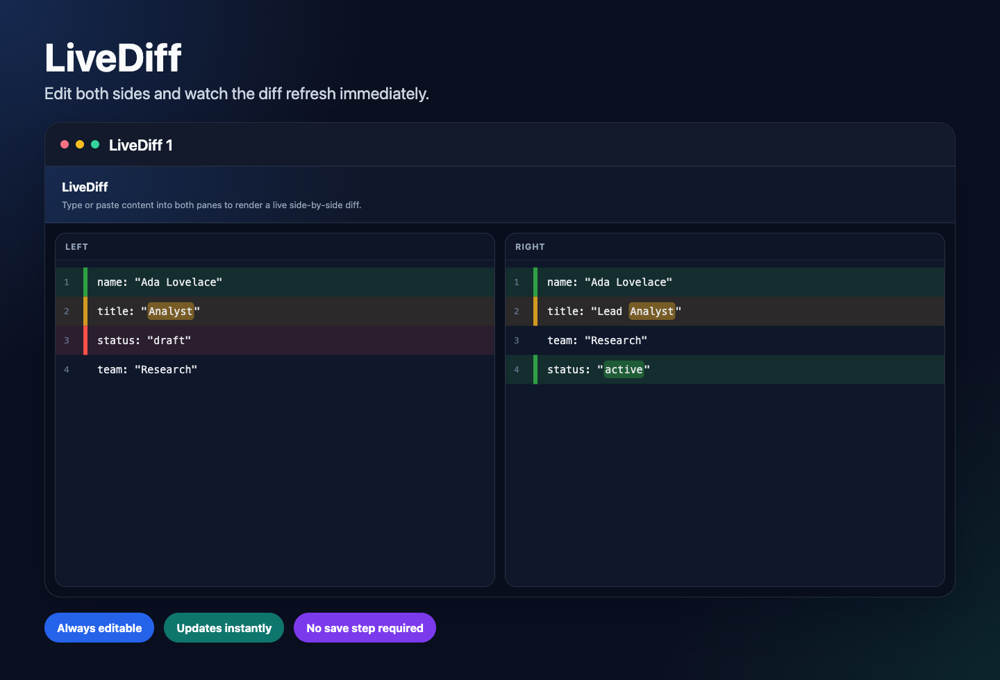

# LiveDiff

LiveDiff is built for one job: compare text while you are still editing it.

Launch it with `Cmd+Ctrl+Shift+D` or run `LiveDiff: Open Comparison` from the Command Palette.

Most diff tools make you stop, save, switch views, or reopen a comparison every time the content changes. LiveDiff keeps two editable panes open side by side and refreshes the diff immediately as you type or paste, so the comparison never interrupts the flow of editing.

## Why it is called LiveDiff

The diff is always on and always current.

- Paste on the left and right, then start editing either side right away.
- Keep both panes editable while the diff stays visible.
- See line changes and inline changes update immediately after each edit.
- Open multiple comparison tabs when you want to compare more than one pair of snippets.

## How it is different from typical diff tools

- No temporary files required: it is designed for scratch comparisons, copied text, generated output, logs, and JSON snippets.
- No mode switch between editing and reviewing: you do not leave the editors to see the diff.
- No rerun step after each change: the comparison refreshes automatically as the content changes.
- Better for quick iteration: tweak either side until the diff shows exactly what changed.

## Quick Start

1. Run `LiveDiff: Open Comparison`.
2. Paste or type content into the left and right panes.
3. Edit either side and watch the diff update live.
